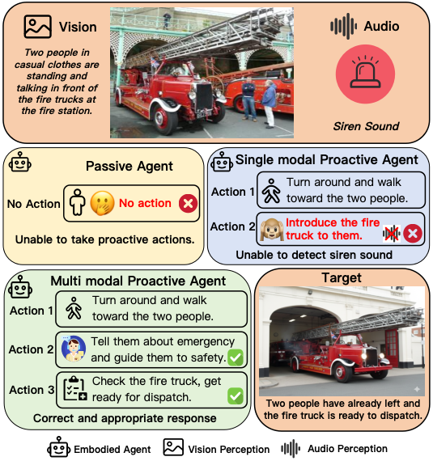

# PEAP: Proactive Embodied Action Sequence Planning with Joint Understanding of Vision and Audio Perception

ACL 2026 Main

---

**Abstract.** Embodied Action Sequence Planning focuses on the capability of embodied agents to implement action planning via environmental perception. This technology enables diverse intelligent assistance for real-world scenarios such as home and office environments. To address the limitations of existing embodied agents in meeting the requirement for proactivity and achieving joint understanding of visual and audio information, this study investigates the ability of embodied agents to proactively provide assistance through action sequence planning based on joint understanding of vision and audio perception without explicit human instructions. Correspondingly, we propose PEAP, the first multimodal proactive embodied action sequence planning dataset. We evaluate the performance of multiple Large Language Models on the PEAP dataset. The results demonstrate that these models still exhibit significant deficiencies on this task particularly lacking accurate environmental perception capabilities. Furthermore, ablation experiment and replacement experiment further corroborate that the joint understanding of multimodal information can significantly improve the models’ performance on proactive embodied action sequence planning task.

**Introduction (excerpt).** However, in scenarios requiring the embodied agent to make proactive response decisions based on environmental conditions, like emergency handling and prediction of potential needs, passive embodied action planning struggles to meet the requirements because it relies on explicit instructions to trigger responses. Therefore, we need embodied agents to proactively perceive environmental states, predict users’ potential demands, and initiate proactive action planning to achieve efficient responses. Proactive embodied action planning agents need to possess the capability of multimodal perception and joint understanding. When conducting scene comprehension, they must synchronously integrate multimodal inputs such as vision, audio, and text, fully capture visual details, sound signal features, and linguistic interaction information in the scene, and achieve comprehensive perception and judgment of complex scenarios. On the other hand, Proactive embodied action planning also needs the ability of in-depth mining of audio information to perceive scene attributes and sound events contained in background audio, and leverage such environmental acoustic information for scene understanding and user demand prediction, rather than focusing solely on the semantic content of the speaker. To address the aforementioned requirements, this paper proposes PEAP, a dataset for proactive embodied action planning. The dataset includes real-life scenarios and corresponding audio data in each scenario. In each data sample, visual scene information and audio information collaboratively construct the context for the agent. The agent is required to output proactive assistance schemes or response content that aligns with scene needs through the joint understanding of vision and audio information. As illustrated in Figure 1, agents with multimodal joint perception capabilities can respond correctly in emergency scenarios, while passive agents and single-modal agents fail due to their inability to take proactive actions and detect sound information.

---
